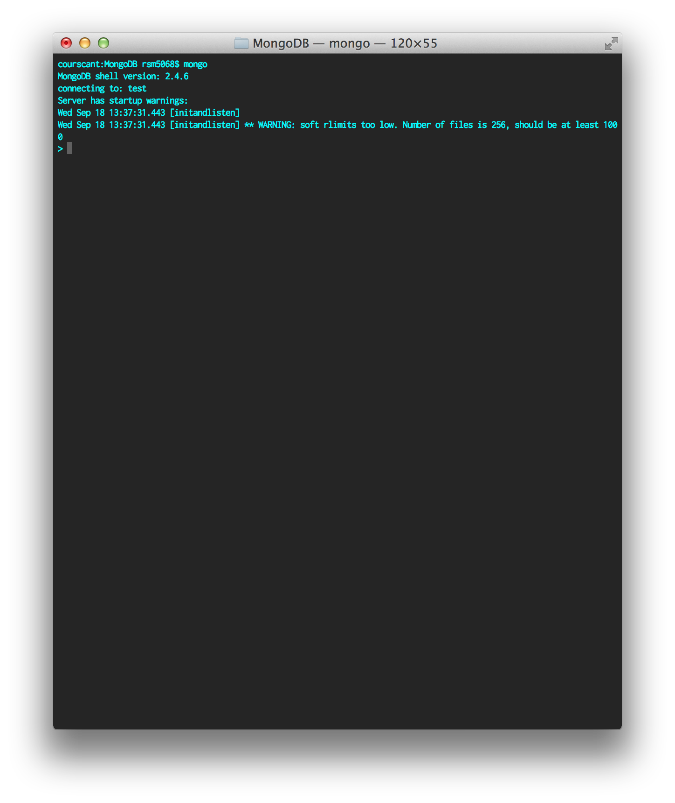

Piping Twitter into MongoDB
===========================

# Background 

This tutorial created as part of a series of tutorials used in the graduate-level seminar _Geography 597A: Visual Analytics &mdash; Leveraging GeoSocial Data_ at Penn State (held Fall 2013). These tutorials are designed to introduce students, with varying backgrounds, to the tools and skills employed in the collection, processing, and visualization of geographically attributed big data from social media outlets. 

This tutorial, the third in a series of four, covers the use of MongoDB as a datastore to hold the response to a request to the Twitter Streaming API. This tutorial uses [Node.js][nodejs] (a JavaScript-based application platform), [MongoDB][mongo] (a document-oriented database), and the [Twitter Streaming API][twitterapi] as the core technologies, though others may 
be used to produce the same result. 

### Goals

At the completion of this tutorial you will be able to:

* Install MongoDB on your system (OS X, Windows)
* Start a persistent MongoDB server
* Pipe Twitter API responses into MongoDB
* Create an index on target query fields

### Other Tutorials

* Building a Simple Twitter Scraper, by Sasha Savelyev
* Introduction to Leaflet: Visualizing Twitter Data, by Josh Stevens


# Prerequisites 

Before we begin, it's worth noting a few prerequisites. This tutorial assumes that you have the following skills, or completed the following tasks.

### Skills

* Some experience with the JavaScript programming language
* Some knowledge of JSON data structures
* Some experience with databases (relational, document-driven, or otherwise)
* Some experience with a *nix terminal or the Microsoft Command Prompt

### Tasks

* (Optional) Installed [homebrew][homebrew] on your machine (OS X only)
* Installed Node.js on your personal machine ([downloads][installnodejs])
* Completed the demo "Building a Simple TWitter Scraper" (presented on 5 Sep 2013)
* [Downloaded][installmongo] the MongoDB installer (v2.4.6)


# Introducing MongoDB

So what exactly is MongoDB? 

Mongo is a document-driven database that is designed to handle large volumes of (unstructured) data. You may be familiar with relational databases, which use highly rigid structures to organize data and optimize access times. These databases are easy to query (using SQL) but not very flexible, so any slight change in the data can cause all kinds of headaches, even if the existing structures haven't changed. Document-driven databases are more flexible in terms of how they store and allow you to access data. MongoDB stores data as a series of BSON documents, a binary encoding of JSON data structures. This storage mechanism is very flexible but also has a price, reduced access speed.

MongoDB installations are organized into a series of databases. Databases are  a series of collections, which contain the individual documents of data. 

Mongo provides a command interface with that standard installation, which will be explained later in this section. Mongo databases can also be manipulated from applications using drivers that support native interfaces in languages like Ruby, Python, Perl, and, in our case, JavaScript.


## Installing MongoDB

Installing MongoDB is kind of a hassle sometimes, so rather than rewrite the existing walk-throughs on this process I have provided the links to MongoDB Inc.'s instructions below. 

* [Install on OS X](http://docs.mongodb.org/manual/tutorial/install-mongodb-on-os-x/)
* [Install on Windows](http://docs.mongodb.org/manual/tutorial/install-mongodb-on-windows/)
* [All Other Installer Tutorials](http://docs.mongodb.org/manual/installation/)

Once you install MongoDB you will have access to two command line applications, `mongod` and `mongo`. The `mongod` program is the actual server and data store that you connect to when you want to store or manipulate data. It is best to set this server up to launch automatically on startup (either [as a service](http://docs.mongodb.org/manual/tutorial/install-mongodb-on-windows/#mongodb-as-a-windows-service) on Windows or or user a [launcher daemon](http://pragmaticstartup.wordpress.com/2013/02/24/auto-start-mongodb-mac-osx/) on a Unix-based system like OS X). The `mongo` program is the native command interface to the MongoDB Server. This will be discussed further in the a later section. 

### Alternate Installation Method for OS X

For OS X users, there is a simpler method for installing and updating MongoDB (and Node.js): [homebrew][homebrew]. Homebrew is a command line utility for managing software packages, similar to `yum` (Red Hat) and `apt-get` (Ubuntu/Debian) Linux distributions. 

Once homebrew is installed, simply type the following command into a terminal. 

```shell

    $ brew update && brew install mongodb 

```shell

To install Node.js using homebrew enter the following command into a terminal.

```shell

    $ brew update && brew install node

```

To upgrade MongoDB or Node.js use enter the following command into a terminal.

```shell
   
    $ brew update && brew upgrade mongodb && brew upgrade node

```
Follow the same steps as mentioned previously to start the MongoDB Server on your machine. 

A similar workflow exists for using `apt-get` on Linux machines.

## Using the Command Interface

The command interface is the easiest way to quickly inspect a MongoDB database. Once you have the `mongod` service started, open a terminal or command prompt and enter the following command.

```shell

    $ mongo

```

You will be presented with something like the interface shown in Figure 1. 



From here you can use commands to look at manipulate databases, collection, and data.

Some of the commands are systems commands, structured and executed as they would be from the command line. For example, by default your session in the command interface uses a database named 'test', if you want to see which other databases are available on the system you would use the `show` command to look at all the databases (collectively referenced as the variable `dbs`). Another example is the `use` command, which allows you to specify which database to use during the session. 

To actually manipulate data you use a series of commands that follow a more JavaScript-like syntax. To manipulate the active database you use the functions available to the `db` variable. Collections within this database can be referenced by name, so if we want to manipulate the 'tweets' collection in the 'streaming_db' database we would start commands with the prefix `db.tweets`. From here you can query the database using the `find()` function, count the number of records using the `count()` function, and so on. 

Below are some examples of commands that I have run while developing this demo to make sure the database is being populated correctly (results shown in Figure 2). For a complete listing of the functions available from the command interface see the [MongoDB Documentation][mongodocs].

```shell

    > show dbs          // Shows all the databases available on the machine
    > use streaming_db  // Switched to use the 'local' database, 'db' variable points to 'local'
    > db.tweets.count() // Number of records in the collection
    > db.tweets.find()  // Returns all documents in the database (displays first 10 to console)

```


We will come back to this interface in a bit to do some real work. Right now I just want you to know that it exists, and that it can be used to interface directly with the data from the command line.


# Upgrading the Scraper

Now that you are familiar with MongoDB, at least on a surface level, let's take a look at how to integrate this with Node.js. For this section we will be building on the "Bulding a Simple Twitter Scraper" tutorial. If you have already completed this tutorial then you should continue on using the directory structure and code you used for that project. If you have not completed this tutorial I strongly suggest working your way through it, but I have included the final state of the code from that lab (file: scraper_simple.js). 

All code for this demo is provided in the file called 'scraper.js'. You can simply copy and paste this code into a file you have already created, or follow along with the steps outlined below. 

## NPM Modules

This demo is built upon Node.js and in order to interface with the MongoDB Sever we need to install a driver. The Node.js driver for MongoDB is available through the Node Package Manager. To install it (and the other packages required for this demo) navigate to the directory where you are storing the files for this demo and type the following commands.

```shell

    $ npm install mongodb
    $ npm install ouath

    # ---- Or, to do it all at once ----

    $ npm install mongodb && npm install ouath

```

## Integrating MongoDB into the Scraper

As I mentioned before, the final code used in scraper built for this demo is provided, so feel free to use that. But, if you prefer to follow along, the steps below outline how to transform the code from the 'scraper_simple.js' file into the code in the 'scraper.js' file. 

Please note that I am writing this tutorial with the assumption that you are starting with the 'scraper_simple.js' file I provided. So, if your code looks different then you may need to ask for some help in moving things around. 

### Step 1: Module Imports

Open the 'scraper_simple.js' file in your favorite text editor (I recommend [Sublime Text][sublime] if you don't have one already, it says it costs money but the free tutorial) and re-save is as 'scraper.js'. You'll see I have sectioned off the code into three major sections (using comments that look like this `// ---- STUFF ----`) &mdash; Module Imports, Processing Functions, and Connecting to Twitter. Let's take a look at the Module Imports section first. 

In the previous step you installed the MongoDB driver for Node.js. Now we need to make an import statement in the scraper so that we can use this driver while the application is running. The code to do this is listed below

```JavaScript

    var http = require('https');
    var fs = require('fs');
    var oAuth = require('oauth').OAuth;
    var mongo = require('mongodb');         // <-- Add this one

```

### Step 2: Connecting to MongoDB Server

Now that we have the MongoDB driver accessible, let's use it. Before the Processing Functions section add in the following lines of code. 

```JavaScript

    var mdbServer = mongo.Server('localhost', 27017, {'auto_reconnect' : true});
    var mdb = mongo.Db('streaming_db', mdbServer);

```

These line created two variables, `mdbServer` and `mdb`. The `mdbServer` variable is created using the `Server()` function provided by the MongoDB driver. We set it to connect to the MongoDB Server running on your local machine (started once you installed MongoDB) and to automatically reconnect to the server is the connection is ever lost. The 'mdb' variable uses the `Db` function, provided by the driver, to specify the database (in this case a database named 'streaming_db') you would like to manipulate, and the connection that can be used to acess this database. 

Now to open up this database for manipulation. Insert the following lines of code below the lines you just inserted. 

```JavaScript

    mdb.open(function (err, db) {
        if (!err) { console.log('Connected to streaming_db@localhost:27017'); }

        db.createCollection('tweets', function (err, collection) {

        }
    }

```

These lines tell the `mdb` variable to actually open a connection to the database, and provide a callback function to be executed when the connection is made. This first callback function has two purposes. First, to check and make sure no errors occurred when opening the connection, and if there were none print a statement to the console saying that the connection has been made. Second, to use the `db` variable to create a collection for the tweets to be stored into. This is done using the `createCollection()` function, which attempts to create a collection in the database and returns that collection to the callback function for manipulation. If a collection with that name already exists it is simply returned to the callback function.

Now you should have an application that allows you to connect to a local MongoDB database. To test this enter the following commands on the command line. 

```Shell

    $ node scraper.js

```

You should see output to the console similar to what is shown in Figure 3. 


### Step 3: Refactoring 

You have an application with two functioning components &mdash; a scraper printing results to the console, and a connection to a local database. It's time to move some things around so that the tweets can be easily inserted into the database. 

If you look at the second code block from Step 2 you'll see we created a callback function that we pass to the `createCollection()` function, but it has no body. This was done intentionally, because a lot of the body has already been written and just needs to be moved into place. Select all of the code (and comments) in the Processing Functions and Connecting to Twitter sections, cut and paste this into the body of the callback function we pass to the `createCollection()` function. The code below shows what the results of this cut and paste will look like.

```JavaScript 

    mdb.open(function (err, db) {
        if (!err) { console.log('Connected to streaming_db@localhost:27017'); }

        db.createCollection('tweets', function (err, collection) {

            // ---- Processing Functions ----

            var firstTweet = true;

            function processResponseData(data) {
                var tweet = data.toString();
                var parsedTweet = JSON.parse(tweet);

                if (firstTweet) {
                    console.log(tweet);
                    firstTweet = false;
                } else {
                    console.log(",\n");
                    console.log(tweet);
                }
            }

            // ---- Connecting to Twitter ----

            var oa = new OAuth("https://api.twitter.com/oauth/request_token",
                "https://api.twitter.com/oauth/access_token", 
                "CK-000xxx",
                "CS-000xxx",
                "1.0A", 
                "http://www.geovista.psu.edu/SensePlace2/", 
                "HMAC-SHA1"
            );

            var request = oa.get("https://stream.twitter.com/1.1/statuses/filter.json?locations=-77.9,40.7,-77.8,40.8",
                "AT-000xxx",
                "AS-000xxx"
            );

            request
                .addListener('response', function (response) {
                    response.on('data', processResponseData);
                })
                .end();
        });
    });

```

The result is an application that scrapes Tweets and prints them to the console only after a connection to the database has been made. 

### Step 4: Inserting Records

With the connection to the database triggering the scraping of tweets, we can now start to work on storing the tweets in the database. The process for this is rather simple. You only need to make one more change, in the body of the `processResponseData()` function. Replace the code in the body of this function with the code below. 

```JavaScript

    try {
        if (tweetCount < 1000000){
            var parsedTweet = JSON.parse(data.toString());

            if (parsedTweet.id && parsedTweet.id_str) {
                parsedTweet._id = new mongo.Long.fromString(parsedTweet.id_str, 10);

                collection.insert(parsedTweet, function (err, doc) {
                    console.log("Error writing document to database. Most likely a duplicate.");
                });

                tweetCount++;
            }
        } else { 
            db.close();
            process.exit(0); 
        }
    } catch (e) {
        console.log("Exception thrown: " + e.message);
    }

```

This code tries to take the response from the Twitter API, parse it into a native JSON Object, give the parsed object a unique identifier to be used by MongoDB (the `_id` variable), and insert it into the collection. 

You may also notice the If-Else block encapsulating this code. This block is designed to limit the number of tweets that the application will put into the database before terminating, which happens when the else clause is executed (a feature designed to limit the space requirements). I have decided to make the default maximum 1,000,000 Tweets, but you can change that as you see fit. To ensure that this works you need to define a new variable `tweetCount` outside of the body of the `processResponseData()` function. Paste the code below after the closing brace of the `processResponseData()` function. 

```JavaScript

    var tweetCount = 0;

```

Now you're ready. You have an application that can scrape one million Tweets and store them in a local database. Time to get to work.

### Step 5: Running Scraper Long-term

Collecting one million tweets takes some time, maybe quite a long time. To make your life easier, and let you do other things while this is all going on, let's automate this process. 

**For Windows Users**

Windows command prompts, unlike their Unix/Linux equivalents, do not kill their processes when you close the session. But when you run a Node.js application on Windows, it still opens a command prompt window to log console output to. To avoid this (because they are kind of unsightly, and when the app is running cannot be used for anything else) you will run the following command from a Command Prompt.

```Shell

    > start /min node scraper.js

```

This will start a new process for the scraper in a new command prompt window and minimizes that window so it doesn't take up too much space. Simply leave your computer on and awake and after a while the process will finish and disappear from your Taskbar.

**For Unix-based and Linux Users**

Unix-derived terminals kill all processes started within them when you end the session. This becomes a slight problem, because when a process like Node.js is running it needs a place to log console output to, which turns out to be the terminal you started it in. To avoid killing the process when you exit the terminal the No Hangup, `nohup`, command was created. To start a `nohup` process that will run in the background, simply append an "&amp;" at the end of the command. 

```Shell

    $ nohup node scraper.js &

```

The command above will start scraping Tweets in the background on a Unix-derivative system. Now to leave your machine on and wait for it to complete. You can check to see if it is still up and running, any output means that it is still up and running. 

```Shell

    $ ps -ax | grep "node scraper.js"

```

## Building Indices 

Once you've collected enough tweets, you can start to run queries on those tweets. The interesting things about tweets are typically in the text, but text is hard to query quickly. To speed up this process you're going to build an index &mdash; a fast look-up table linking keys to the documents that contain those keys &amp; on the text portion of the tweets in the collection using the [`ensureIndex()`][mongoindex] function. This command will make use of the command interface we discussed earlier in this tutorial, but instead of actually entering the interactive interface we will simply have the `mongo` program evaluate and run a command we give it as a parameter. Creating a text index can take some time, though, so it's best to use the long-run procedure we used in Step 5. 

**For Windows Users**

Run the following command line to create an index on text of the tweets you collected.

```Shell 

    > start /min mongo streaming_db --eval "db.tweets.ensureIndex({'text':'text'})"

```

**For Unix-based and Linux Users**

Run the following command line to create an index on text of the tweets you collected.

```Shell 

    $ nohup mongo streaming_db --eval "db.tweets.ensureIndex({'text':'text'})" &

```

# Next Steps

Now that you have completed this demo, you have a scraper capable of collection and storing tweets. In the next demo in this series you will learn how to: 

* create a simple web service to query this database from an external application;
* refactoring the application you made in the "Introduction to Leaflet" tutorial to request data from this web service;
* add a query field so that the user can look at different topics and hashtag usage in the dataset you have collected.

<!-- Hyperlinks -->

[homebrew]: http://brew.sh
[nodejs]: http://nodejs.org
[installnodejs]: http://nodejs.org/download/
[mongo]: http://mongodb.org
[installmongo]: http://www.mongodb.org/downloads
[installmongopm]: http://www.mongodb.org/downloads#packages
[mongodocs]: http://docs.mongodb.org/manual/
[mongoindex]: http://docs.mongodb.org/manual/core/text-search/#create-a-text-index
[twitterapi]: https://dev.twitter.com/docs/streaming-apis/streams/public
[simplescraper]: http://
[introleaflet]: http://
[sublime]: http://www.sublimetext.com/